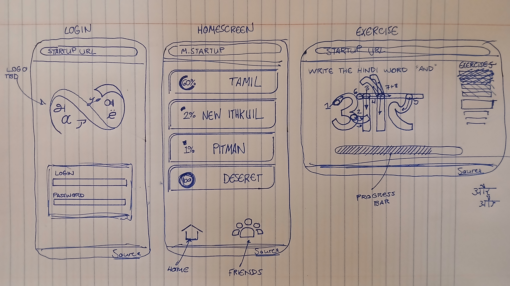
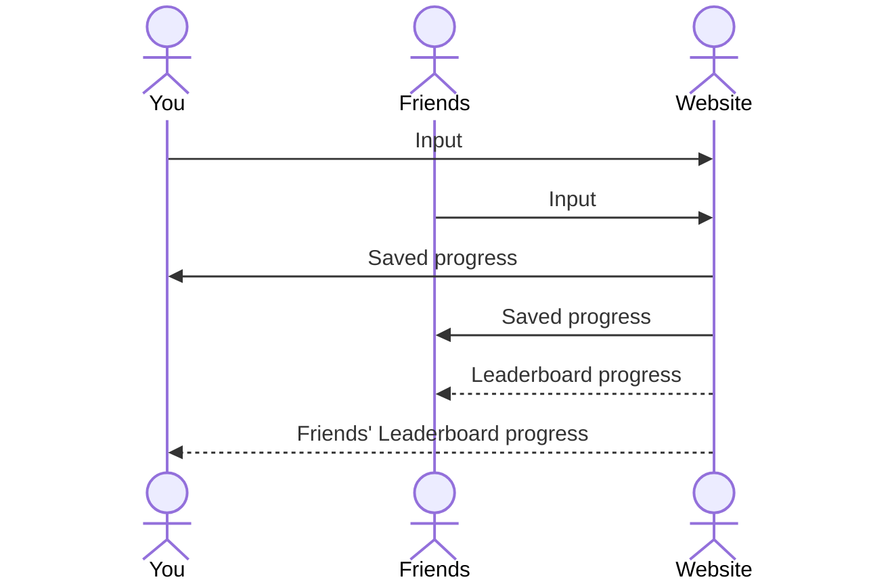

# ANYO: Multilingual Penmanship

[My Notes](notes.md)

This website is simply meant to supplement the user's second language acquisition with writing practice in their target script for learning to write individual letters/characters and simple words. Ideally, this website is used on mobile devices with touchscreen capabilities (and thus would honestly be better suited as an app).

However, this website can also expand to include practice for different forms of writing within a single language, such as Pitman shorthand, Deseret, or cursive for English.

> [!NOTE]
>  This is a template for your startup application. You must modify this `README.md` file for each phase of your development. You only need to fill in the section for each deliverable when that deliverable is submitted in Canvas. Without completing the section for a deliverable, the TA will not know what to look for when grading your submission. Feel free to add additional information to each deliverable description, but make sure you at least have the list of rubric items and a description of what you did for each item.

## 🚀 Specification Deliverable

> [!NOTE]
>  Fill in this sections as the submission artifact for this deliverable. You can refer to this [example](https://github.com/webprogramming260/startup-example/blob/main/README.md) for inspiration.

For this deliverable I did the following. I checked the box `[x]` and added a description for things I completed.

- [x] Proper use of Markdown
- [x] A concise and compelling elevator pitch
- [x] Description of key features
- [x] Description of how you will use each technology
- [x] One or more rough sketches of your application. Images must be embedded in this file using Markdown image references.

### Elevator pitch

Writing is a huge language learning, especially when it comes to practicing comprehension and high-level thought expression, but its underdeveloped in mobile language learning platforms. This mobile website aims to supplement language learners with opportunities to properly learn and practice writing letters/characters and common words in their target language according to its unique practices, so that students' second language acquisition becomes more balanced and aligned culturally.

### Design

This sketch contains a login screen, a homepage screen (with hints at a separate friends tab for the leaderboard), and an exercise screen within a lesson.

### Key features

- Secure login with HTTPS
- Progress saving per lesson to the login
- Trace/touch capabilities for writing practice (mobile only)
- Connection to friends with access to their progress in a leaderboard fashion

### Technologies

I am going to use the required technologies in the following ways.

- **HTML** - Four HTML pages: Login, Language/Lesson Selection, Writing Practice, and Friends Leaderboard.
- **CSS** - Good styling to different screen sizes, consistent branding & colors.
- **React** - Provides login feature, displays language choices. Used in tracing feature of exercises.
- **Service** - Backend service with endpoints for:
    - Login
    - Language data from outside dictionary API
    - and more!
- **DB/Login** - Stores users, their progress per langauge, language data in databases.
- **WebSocket** - Provides progress-saving capabilities as well as friends leaderboard updates.

## 🚀 AWS deliverable

For this deliverable I did the following. I checked the box `[x]` and added a description for things I completed.

- [x] **Server deployed and accessible with custom domain name** - [Anyo Handwriting](https://anyohandwriting.page).

## 🚀 HTML deliverable

For this deliverable I did the following. I checked the box `[x]` and added a description for things I completed.

- [x] **HTML pages** - I created five .html pages for the login, homepage, course, lesson, and leaderboard areas of the website.
- [x] **Proper HTML element usage** - I used various elements such as `<form>` and `<nav>`.
- [x] **Links** - I included links to the github repository in the footer as well as to other areas of the website for navigation.
- [x] **Text** - I included text for placeholder descriptions of parts of the website as well as for branding.
- [ ] **3rd party API placeholder** - I did not complete this part of the deliverable.
- [x] **Images** - I included a placeholder image of the website's logo. This will be
- [x] **Login placeholder** - I created a placeholder login in index.html
- [x] **DB data placeholder** - The placeholder would be found with the lesson.html (since most data would be for lesson work)
- [ ] **WebSocket placeholder** - I did not complete this part of the deliverable.

## 🚀 CSS deliverable

For this deliverable I did the following. I checked the box `[x]` and added a description for things I completed.

- [x] **Header, footer, and main content body** - I added a header and footer, both with navigation to other parts of the website or to the github repository.
- [x] **Navigation elements** - I added basic navigation and kept a consistent color scheme
- [x] **Responsive to window resizing** - I included flex work to resize the window in standard instances (more will be done to enhance resizing for iPad usage.)
- [x] **Application elements** - I included formatting for main elements which will include application content, images, 
- [x] **Application text content** - I created formatting for text content including border work, padding, text color, background color, and other CSS properties.
- [ ] **Application images** - I did not complete this part of the deliverable. The images themselves have yet to be made, and they will be made soon.

## 🚀 React part 1: Routing deliverable

For this deliverable I did the following. I checked the box `[x]` and added a description for things I completed.

- [ ] **Bundled using Vite** - I did not complete this part of the deliverable.
- [ ] **Components** - I did not complete this part of the deliverable.
- [ ] **Router** - I did not complete this part of the deliverable.

## 🚀 React part 2: Reactivity deliverable

For this deliverable I did the following. I checked the box `[x]` and added a description for things I completed.

- [ ] **All functionality implemented or mocked out** - I did not complete this part of the deliverable.
- [ ] **Hooks** - I did not complete this part of the deliverable.

## 🚀 Service deliverable

For this deliverable I did the following. I checked the box `[x]` and added a description for things I completed.

- [ ] **Node.js/Express HTTP service** - I did not complete this part of the deliverable.
- [ ] **Static middleware for frontend** - I did not complete this part of the deliverable.
- [ ] **Calls to third party endpoints** - I did not complete this part of the deliverable.
- [ ] **Backend service endpoints** - I did not complete this part of the deliverable.
- [ ] **Frontend calls service endpoints** - I did not complete this part of the deliverable.
- [ ] **Supports registration, login, logout, and restricted endpoint** - I did not complete this part of the deliverable.

## 🚀 DB deliverable

For this deliverable I did the following. I checked the box `[x]` and added a description for things I completed.

- [ ] **Stores data in MongoDB** - I did not complete this part of the deliverable.
- [ ] **Stores credentials in MongoDB** - I did not complete this part of the deliverable.

## 🚀 WebSocket deliverable

For this deliverable I did the following. I checked the box `[x]` and added a description for things I completed.

- [ ] **Backend listens for WebSocket connection** - I did not complete this part of the deliverable.
- [ ] **Frontend makes WebSocket connection** - I did not complete this part of the deliverable.
- [ ] **Data sent over WebSocket connection** - I did not complete this part of the deliverable.
- [ ] **WebSocket data displayed** - I did not complete this part of the deliverable.
- [ ] **Application is fully functional** - I did not complete this part of the deliverable.
